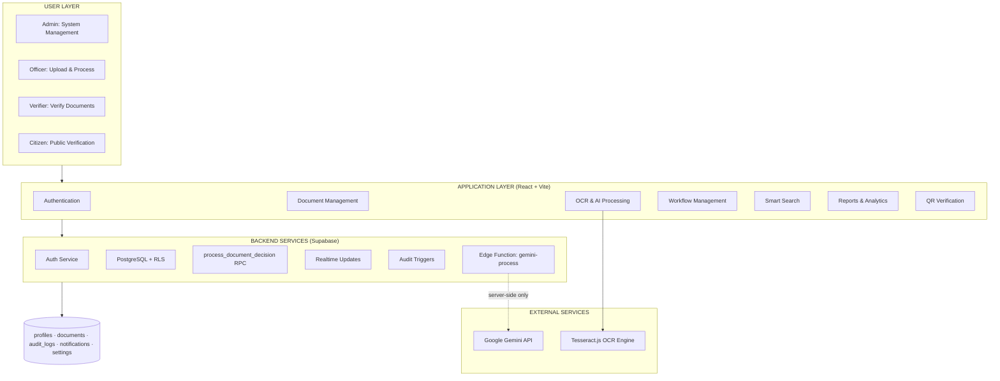
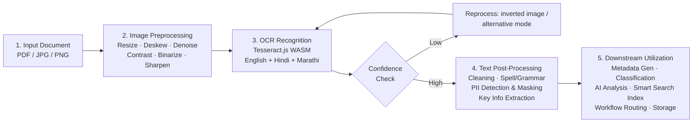

# 🏛️ Smart Digital Documentation System (SDDS)
> **AI-Assisted Digital Document Management & Public Verification Portal**

[](https://react.dev)
[](https://vite.dev)
[](https://tailwindcss.com)
[](https://supabase.com)
[](https://tesseract.projectnaptha.com)
[-8B5CF6?style=for-the-badge)](#-explainable-ai-xai--privacy-methodology)
[](https://smartdocumentatiion.netlify.app/)
[](#testing--validation)
[](./LICENSE)

<p align="center">
  <a href="https://smartdocumentatiion.netlify.app/">
    
  </a>
</p>

> **SDDS** is a web-based digital document management and verification platform that combines multilingual OCR, automated metadata extraction, AI-assisted document analysis, role-based access control, workflow automation, audit logging, smart search, and QR-based public verification — built for **District Collector Offices, Municipal Corporations, Taluka Offices, Revenue Departments, RTOs, and Gram Panchayats**. Developed for **Smart Kopargaon Hackathon (SKH 2026)** by **Team Mavericks**. The implementation is designed as a working prototype rather than a production government deployment.

---

## 📑 Table of Contents

1. [Live Demo & Quick Access](#-live-demo--quick-access)
2. [Problem Statement & Context](#-problem-statement--context)
3. [Key System Capabilities & Architectural Innovations](#-key-system-capabilities--architectural-innovations)
4. [Role-Based Access Control (RBAC)](#-role-based-access-control-rbac)
5. [System Architecture](#system-architecture)
6. [OCR & Text Processing Pipeline](#-ocr--text-processing-pipeline)
7. [Explainable AI (XAI) + Privacy Methodology](#-explainable-ai-xai--privacy-methodology)
8. [Data Model](#data-model)
9. [Technology Stack](#technology-stack)
10. [Repository Structure](#-repository-structure)
11. [Getting Started & Setup Guide](#-getting-started--setup-guide)
12. [Testing & Validation](#testing--validation)
13. [Evaluation Metrics](#-evaluation-metrics)
14. [Government Compliance and Security Features](#government-compliance-and-security-features)
15. [Technical Limitations](#technical-limitations)
16. [Future Technical Improvements](#-future-technical-improvements)
17. [References](#-references)
18. [License](#-license)

---

## 🚀 Live Demo & Quick Access

<div align="center">


 **Live Prototype:** [smartdocumentatiion.netlify.app](https://smartdocumentatiion.netlify.app/) 

</div>

---

## 🎯 Problem Statement & Context

Government and administrative offices process large volumes of certificates, applications, identity documents, revenue records and official documents. Manual classification, metadata entry, routing, approval, retrieval and verification can be slow and error-prone. Scanned documents also require OCR before their contents can be searched or processed automatically.

**Objectives:**
- Digitize and organize uploaded government-style documents.
- Extract searchable text from PDF and image documents using multilingual OCR.
- Automate document classification and metadata extraction using deterministic rules and optional AI assistance.
- Reduce unnecessary exposure of personal data during third-party AI processing through PII masking.
- Provide role-aware document workflows, approvals, audit trails and public verification.

The system follows an **upload → preprocessing → OCR → extraction/classification → privacy filtering → AI-assisted processing (optional) → storage/workflow → search/verification** pipeline. Deterministic fallbacks are used where possible so that core document operations do not depend entirely on an external AI service.

---

## 🌟 Key System Capabilities & Architectural Innovations

### 💡 1. Explainable AI (XAI) Engine & Decision Transparency
- **Weighted Feature Saliency (100% Total)**: Every classification decision breaks down contributions into 5 standardized, deterministic signals:
  - **Document Title Match (30%)**: Matches category title patterns (e.g. *"7/12 Extract"*, *"प्राध्यापक भरती"*).
  - **Keyword Density (25%)**: Evaluates domain keyword frequency in OCR text.
  - **Issuing Organization (20%)**: Identifies government office header patterns.
  - **OCR Quality Score (15%)**: Incorporates character recognition confidence.
  - **Date & Urgency Signals (10%)**: Analyzes submission deadlines and emergency keywords.
- **Observable Decision Trace**: Step-by-step audit log tracing OCR ingestion, pattern matches, mechanism evaluations, routing decisions, and urgency assignments without hidden LLM claims.
- **Dual-Engine Mechanism Consensus**: Compares local rule-based classifier against Gemini AI classifier, computing confidence deltas and issuing `Engines Agree` or `Engines Disagree` alerts.
- **Low-Confidence Handling**: Automatically flags low-confidence results (<60%) or mechanism disagreements for **Manual Review Required**.
- **Decoupled Department Routing**: Separates document classification from administrative department routing with transparent, rule-specific explanations.
- The 5 feature weights are enforced to sum to exactly 100% by an automated test (`tests/xai.test.js`), so the "why this classification" explanation can never silently drift out of balance.

### 🔒 2. Secure AI Gateway & Defense-in-Depth PII Protection
- **Server-Side-Only AI Calls**: All Gemini requests are routed through an authenticated **Supabase Edge Function** (`supabase/functions/gemini-process`). The API key lives only in server environment secrets — it is never bundled into the frontend and never visible in browser DevTools.
- **JWT-Authenticated & Rate-Limited**: The Edge Function verifies the caller's Supabase session token and enforces a 15-requests-per-minute limit per user before contacting Gemini.
- **Two-Layer PII Sanitization**: Text is masked client-side before leaving the browser, then **re-validated server-side** inside the Edge Function — if sanitization cannot be guaranteed, the request is rejected rather than silently sent (`sanitizeForAI()` fail-closed behavior).
- **Detected & Masked Identifiers**: Aadhaar, PAN, GSTIN, Indian mobile numbers, email addresses, Voter ID (EPIC), and Passport numbers — tolerant of OCR spacing/punctuation noise (`src/services/piiService.js`).
- **Confidentiality Mode**: When toggled ON, all cloud AI calls are disabled entirely and processing stays 100% in-browser via WebAssembly OCR.
- **Self-Guarding Regression Test**: `tests/security-check.test.js` scans the entire frontend source tree on every test run and fails the build if a Google API key pattern or the old `VITE_GEMINI_API_KEY` reference is ever reintroduced.

### 🤖 3. Global Floating AI Chatbot Assistant
- **Accessible Across Every Page**: A floating chat widget available in the bottom-right corner of all tabs (`Dashboard`, `Upload`, `Documents`, `Settings`, etc.).
- **Quick Action Chips**: Instant shortcuts for `📊 Show document stats`, `🔍 Find pending documents`, `📋 Recent uploads`, and `❓ How to upload a document?`.
- **Clean Formatting**: Formats markdown headings, bold text, bullet lists (`•`), and horizontal dividers without raw symbols (`###`, `***`).

### 🏁 4. Public QR Code Verification Portal (`/verify/:id`)
- **Login-Free Verification**: Anyone can scan a printed QR code or visit `/verify/:id` to check document authenticity.
- **Minimized Field Exposure**: `getPublicDocumentVerification()` returns only non-sensitive fields (`title`, `status`, `documentNumber`, `department`, `category`, `createdAt`, `updatedAt`), shielding raw OCR text, extracted metadata, and internal workflow data from the public response shape.
- **Downloadable SVG QR**: One-click vector QR code export for official physical printouts.

### 📄 5. Multi-Language OCR & Automatic AI Metadata Extraction
- **Languages Supported**: **English**, **Marathi (Devanagari script)**, and **Hindi**.
- **Pre-Processing Pipeline**: 3× image upscaling, ±8° deskewing, Sauvola adaptive binarization, and median noise reduction filter.
- **Instant Auto-Fill**: Drag-and-dropping a scanned document auto-populates **Title**, **Department**, **Category**, **Priority**, and **2–3 Sentence AI Summaries**.

### 🔍 6. AI-Powered Semantic Smart Search
- **Natural Language Query Matching**: Gemini AI parses queries like *"urgent land files from Revenue Department"* or *"recruitment notices"* and ranks matching documents by semantic relevance.
- **Contextual OCR Snippet Previews**: Displays matching text snippets under search result cards.
- **Client-Side Fallback**: Uses Levenshtein fuzzy matching and weighted keyword scoring when offline or in Confidentiality Mode.

### 🗂️ 7. Server-Enforced Verification Workflow
- **Atomic Decision RPC**: Approving, rejecting, or requesting changes on a document is never a direct table update from the client — it calls `process_document_decision()`, a `SECURITY DEFINER` Postgres function that independently re-checks the caller's role, active status, department match, and current assignment before making any change.
- **Row-Locked Updates**: The document row is locked (`FOR UPDATE`) during the decision to prevent race conditions from two verifiers acting on the same document simultaneously.
- **Immutable Audit Trail**: Every decision is written to `audit_logs` inside the same atomic transaction — there is no database policy allowing audit rows to be updated or deleted.

---

## 👥 Role-Based Access Control (RBAC)

| Feature / Page | Admin | Officer | Verifier | Citizen |
|---|:---:|:---:|:---:|:---:|
| **Dashboard** (`/dashboard`) | ✅ | ✅ | ✅ | ✅ |
| **Upload Documents** (`/upload`) | ✅ | ✅ | ❌ | ✅ |
| **Document Directory** (`/documents`) | ✅ | ✅ | ✅ | ✅ |
| **Public QR Verification** (`/verify/:id`) | ✅ | ✅ | ✅ | ✅ |
| **Explainable AI (XAI) Panel** | ✅ | ✅ | ✅ | ✅ |
| **Floating AI Assistant** | ✅ | ✅ | ✅ | ✅ |
| **Approvals Queue** (`/approvals`) | ✅ (monitor only) | ✅ | ✅ | ❌ |
| **Audit Trail** (`/audit`) | ✅ | ✅ | ✅ | ❌ |
| **Analytics Reports** (`/reports`) | ✅ | ✅ | ✅ | ❌ |
| **User Management** (`/users`) | ✅ | ❌ | ❌ | ❌ |
| **System Settings** (`/settings`) | ✅ | ❌ | ❌ | ❌ |

> Database-level RLS enforces a stricter rule than the UI table above shows: **Verifiers only ever see documents assigned to them within their own department**, and **Citizens only ever see their own uploads** — Admins/Officers see the full set. Admins are explicitly blocked from approving or rejecting documents themselves (enforced inside `process_document_decision()`), keeping oversight and execution separated.

---

## System Architecture



**Deployment**: Frontend SPA on **Netlify**, with `netlify.toml` configuring SPA routing and `Cross-Origin-Opener-Policy` / `Cross-Origin-Embedder-Policy` headers required for multithreaded WASM OCR. AI processing runs on a **Supabase Edge Function** (Deno runtime), fully separate from the static frontend bundle.

---

## 🔄 OCR & Text Processing Pipeline



- **Input**: PDF or image document (multi-page PDFs rendered via `pdfjs-dist`).
- **Recognition**: `Tesseract.js` executes OCR in the browser using WebAssembly — trained language data bundled locally (`eng.traineddata`, `hin.traineddata`, `mar.traineddata`).
- **Post-processing**: confidence information and retry logic are used for weak OCR output.
- **Output**: extracted text becomes the basis for classification, metadata extraction, search, and downstream processing.

---

## 🧠 Explainable AI (XAI) + Privacy Methodology

The system uses an Explainable AI (XAI) layer to make document classification transparent by showing feature contributions from the document title, keywords, organization, OCR confidence, and date signals. A Decision Trace records key processing steps, while rule-based and AI-assisted classification results are compared when available. Privacy is supported through PII detection and masking, which can mask identifiers such as Aadhaar numbers, PAN numbers, GSTINs, and mobile numbers before OCR-derived content is sent to external AI services. AI processing remains optional, with browser-side or local processing preferred for confidential documents where supported, and is now further validated server-side before any external call is made.

---

## Data Model

*Supabase / PostgreSQL — enforced with Row Level Security on every table*

```
Supabase Database (public schema)
├── profiles       — 1:1 with auth.users · role (admin/officer/verifier/citizen), department, status
├── documents      — Core record: file info, status, OCR text, jsonb metadata, jsonb approvals history,
│                    jsonb versions, assigned_verifier_id, auto-generated document_number
├── audit_logs     — Immutable activity trail (no UPDATE/DELETE policy exists — insert-only)
├── notifications  — Per-user alerts (assignment, approval, rejection, upload)
└── settings       — Singleton system config (AI thresholds, OCR languages, PII toggles, retention)
```

**Server-side logic layer (not exposed to the client as raw table access):**

| Function | Type | Purpose |
|---|---|---|
| `generate_document_number()` | Trigger function | Auto-generates department-coded reference numbers (e.g. `SDDS-REV-2026-000123`) |
| `process_document_decision()` | `SECURITY DEFINER` RPC | The only path to approve/reject/request-changes — re-validates role, department, assignment, and document state before writing |
| `trg_document_audit()` / `trg_profile_audit()` | Triggers | Automatically write immutable audit entries on document and profile changes |

| Subsystem | Components | Key Responsibility |
|---|---|---|
| Authentication | Login, registration, recovery, session | Identity & protected application access |
| Document Processing | Upload, OCR, parser, metadata, classifier | Convert files into structured records |
| AI Services | Edge Function proxy, summary service, privacy filtering | Optional AI enhancement & summaries, server-enforced |
| Discovery | Smart search, keyword/entity logic | Search, filtering, ranking, snippets |
| Workflow | RPC-based routing, approvals, status changes | Move documents through configured stages atomically |
| Administration | Users, reports, settings, audit | Administrative control & traceability |
| Verification | QR generation, public verification | Expose limited verification information |

---

## Technology Stack

| Layer | Technology / Component | Purpose |
|---|---|---|
| Frontend | React 18.3 + Vite 5.4 | Single-page web application & routing |
| UI | Tailwind CSS | Responsive interface & component styling |
| Authentication | Supabase Auth | User authentication & session management |
| Database / Backend | Supabase (PostgreSQL + RLS) | Persistent application data & backend services |
| Serverless AI Gateway | Supabase Edge Functions (Deno) | JWT-authenticated, rate-limited Gemini proxy — key never reaches the browser |
| OCR | Tesseract.js / WebAssembly | Multilingual document text extraction (eng + hin + mar) |
| AI (optional) | Google Gemini API | AI-assisted metadata, summaries & analysis |
| PDF/Image | `pdfjs-dist` | Browser-side PDF rendering & OCR preparation |
| Testing | Vitest | Unit, workflow, RBAC, PII, and static security regression tests |
| Deployment | Netlify | Web prototype deployment (SPA routing, COOP/COEP headers) |
| Verification | QR generation + public verification route | Document verification workflow |

**System Requirements**
- Development: Node.js 18+ and npm 9+.
- Runtime: modern Chromium / Firefox / Safari-class browser with JavaScript enabled.
- Backend: configured Supabase project for authentication, data persistence, and Edge Function deployment.
- AI mode: Gemini API key configured as a **Supabase Edge Function secret** (server-side only — never in frontend `.env`).
- Document processing: sufficient client CPU/RAM for browser-side OCR, especially for multi-page PDFs.

---

## 📁 Repository Structure

```
smartDocumentation/
├── netlify.toml                    # Netlify SPA routing & COOP/COEP WASM headers
├── supabase/
│   ├── migrations/
│   │   ├── 001_initial_schema.sql          # Tables, sequences, document numbering, RLS enablement
│   │   ├── 002_rbac_verifier_assignment.sql # Per-role RLS policies, department-scoped access
│   │   ├── 003_document_decision_rpc.sql    # Atomic SECURITY DEFINER approval/reject RPC
│   │   └── 004_audit_triggers.sql           # Immutable audit trail triggers & policies
│   └── functions/
│       └── gemini-process/index.ts # JWT-authenticated, rate-limited Gemini Edge Function proxy
└── project/                        # Frontend Web Application
    ├── public/
    │   ├── tessdata/                # eng / hin / mar Tesseract language data
    │   ├── tesseract-core/          # Tesseract WASM runtime
    │   └── pdfjs/                   # PDF.js cmaps, fonts & WASM
    ├── tests/                       # Vitest automated test suite
    │   ├── classification-benchmark.test.js
    │   ├── document-workflow.test.js
    │   ├── pii.test.js
    │   ├── rbac-auth.test.js
    │   ├── security-check.test.js   # Fails the build if a leaked API key pattern is found
    │   └── xai.test.js
    ├── src/
    │   ├── components/
    │   │   ├── layout/               # Sidebar, Navbar, Layout, FloatingChatbot, ErrorBoundary
    │   │   ├── shared/                # PageHeader, Badges, XAIPanel, AIInsightsPanel
    │   │   └── ui/                    # Button, Card, Input, Modal, Badge, Skeleton, Tabs
    │   ├── hooks/
    │   │   └── useOCR.js              # OCR lifecycle hook
    │   ├── lib/
    │   │   ├── api.js                 # Canonical Supabase-backed API client
    │   │   ├── auth-context.jsx       # Supabase Auth state & profile reconciliation
    │   │   ├── privacy-context.jsx    # Confidentiality Mode state
    │   │   ├── theme-context.jsx      # Dark / Light theme provider
    │   │   ├── toast-context.jsx      # Toast notification provider
    │   │   ├── supabase.js            # Supabase client
    │   │   └── mock-data.js           # Departments, categories & UI constants
    │   ├── pages/
    │   │   ├── upload.jsx              # Drag & drop OCR upload with instant auto-fill & XAI preview
    │   │   ├── document-list.jsx       # Document directory / management
    │   │   ├── document-details.jsx    # OCR text, AI Insights Panel, XAI Panel
    │   │   ├── verify.jsx              # Public QR verification portal
    │   │   ├── search.jsx              # Full-width AI semantic search
    │   │   ├── approvals.jsx           # Approve / Reject / Request Changes queue
    │   │   ├── audit-trail.jsx         # Complete activity log
    │   │   ├── notifications.jsx / profile.jsx
    │   │   ├── dashboard.jsx / reports.jsx / users.jsx / settings.jsx
    │   │   └── login.jsx / register.jsx / forgot-password.jsx / reset-password.jsx
    │   └── services/
    │       ├── xaiEngine.js          # XAI saliency, decision trace, consensus engine
    │       ├── piiService.js         # PII detection, masking & AI pre-flight sanitization
    │       ├── documentClassifier.js # Rule-based document classification
    │       ├── documentParser.js     # Structured field extraction
    │       ├── ocrService.js         # Tesseract.js WASM multilingual OCR pipeline
    │       ├── pdfService.js         # PDF page extraction (pdfjs-dist)
    │       ├── imageService.js       # Image preprocessing (deskew, binarize, denoise)
    │       ├── aiService.js          # Edge Function client, AI search, summaries
    │       ├── keywordService.js     # Keyword/entity extraction
    │       ├── metadataService.js    # Metadata generation
    │       ├── smartSearch.js        # Ranking, filtering, fuzzy matching
    │       ├── summaryService.js     # AI summaries
    │       └── workflowAutomation.js # Auto-routing decision engine
    ├── utils/fileUtils.js
    └── package.json
```

---

## ⚡ Getting Started & Setup Guide

### 1. Prerequisites
- **Node.js**: v18.0.0 or higher
- **npm**: v9.0.0 or higher
- **Supabase CLI** (for Edge Function deployment)

### 2. Installation
```bash
git clone https://github.com/Harshal-112/HackathonProject.git
cd HackathonProject/project
npm install
```

### 3. Environment Configuration
Create a `.env` file in the `project/` directory:
```env
VITE_SUPABASE_URL=https://your-supabase-project.supabase.co
VITE_SUPABASE_ANON_KEY=your-supabase-anon-key
```
> Note: the Gemini key is **not** set here. It is configured only as a server-side Supabase Edge Function secret (Step 5).

### 4. Running Locally
```bash
npm run dev
```
Open `http://localhost:5173` in your browser.

### 5. Deploy the AI Edge Function
```bash
supabase functions deploy gemini-process
supabase secrets set GEMINI_API_KEY=your-google-gemini-api-key
```

### 6. Run the Test Suite
```bash
npm test              # run all tests once
npm run test:coverage # run with coverage report
```

### 7. Production Build
```bash
npm run build
npm run preview
```

---

## Testing & Validation

### Automated Test Suite (Vitest)

Run with `npm test`. Six focused test files cover the system's highest-risk logic:

| Test File | What It Verifies |
|---|---|
| `xai.test.js` | The 5 XAI feature weights always sum to exactly 100% — the transparency layer can't silently drift |
| `pii.test.js` | Aadhaar/PAN/GSTIN/phone/email/Voter ID/Passport patterns are correctly detected and masked, including OCR-noisy input |
| `rbac-auth.test.js` | Role boundaries hold — e.g. Admins are strictly rejected from approving/rejecting documents themselves |
| `document-workflow.test.js` | Auto-routing correctly maps document types (e.g. Land Records) to the right department |
| `classification-benchmark.test.js` | Rule-engine classification accuracy is measured against a labelled benchmark dataset |
| `security-check.test.js` | Scans the entire `src/` tree and fails the build if a Google API key pattern or the old exposed-key env var ever reappears |

### Functional Test Cases (Manual UAT)

| ID | Test Case | Expected Result | Status |
|---|---|---|:---:|
| T01 | Upload valid PDF/image | File is accepted and processing starts | PASS |
| T02 | OCR English document | Readable English text is extracted | PASS |
| T03 | OCR Hindi document | Devanagari text is extracted | PASS |
| T04 | OCR Marathi document | Devanagari text is extracted | PASS |
| T05 | Metadata extraction | Relevant fields are populated or flagged | PASS |
| T06 | PII masking | Supported identifiers are masked before AI processing | PASS |
| T07 | AI summary/metadata | AI output is returned when AI mode is available | PASS |
| T08 | Smart search | Relevant records are returned and ranked | PASS |
| T09 | Approval workflow | Status changes are persisted correctly via `process_document_decision()` | PASS |
| T10 | Audit logging | User action appears in audit history and cannot be altered afterward | PASS |

---

## 📊 Evaluation Metrics

*Evaluated against various Government Resolutions (GRs) issued by the Government of Maharashtra.*

| Metric | How to Measure | Target / Reporting |
|---|---|---|
| OCR quality | Character/word accuracy on labelled sample documents | 94.2% (English) · 87.5% (Marathi/Hindi) |
| OCR processing time | Time from upload to extracted text | 3.5 – 6.0 seconds per page |
| Classification correctness | Correct document type / total tested | 91.7% |
| PII masking coverage | Detected supported PII instances masked / detected | 100% |
| Search relevance | Relevant results in top-k for test queries | 92.0% |
| Workflow correctness | Correct routing/status transitions / test cases | 98.3% |

---

## Government Compliance and Security Features

- **DPDP Act 2023**: Two-layer PII scrubbing (client-side + server-side re-validation) prevents citizen data leakage to external LLMs; requests are rejected rather than sent if masking can't be guaranteed.
- **Zero Client-Side Secrets**: The Gemini API key exists only as a Supabase Edge Function secret — never in the frontend bundle, `.env`, or git history going forward.
- **Immutable Audit Trail**: Every upload, approval, rejection, and status change is logged via database triggers with no UPDATE/DELETE policy on `audit_logs` — the trail cannot be edited after the fact, even by an Admin.
- **Authorization Enforced at the Database, Not Just the UI**: Row Level Security scopes every table by role — Verifiers only see documents assigned to them in their own department; Citizens only see their own uploads. Document decisions are only possible through a `SECURITY DEFINER` RPC that independently re-checks authorization server-side.
- **WASM Multithreading Security**: `netlify.toml` headers configured with `Cross-Origin-Opener-Policy` and `Cross-Origin-Embedder-Policy` for safe high-speed Tesseract OCR WebAssembly processing.
- **Regression-Guarded**: An automated test (`security-check.test.js`) runs on every test invocation and fails the build if a leaked-key pattern is reintroduced into the source tree.

---

## Technical Limitations

- OCR quality depends strongly on scan resolution, layout, language and document noise.
- Browser-side OCR can consume significant CPU and memory for large multi-page documents.
- AI-assisted results depend on Edge Function/external API availability when AI mode is enabled.
- This is a working prototype, not a production government deployment with full-scale infrastructure, security testing, or operational governance.
- The public verification endpoint currently limits exposed fields at the application layer; a database-level `SECURITY DEFINER` view/RPC for this specific read path is a planned hardening step (see below).
---

## 🔭 Future Technical Improvements

- Wrap public document verification in a dedicated `SECURITY DEFINER` RPC so field-minimization is enforced at the database layer, not just the client query.
- Add document-specific ML/layout models for more robust classification and field extraction.
- Add stronger tamper detection, digital signatures and integrity verification.
- Scale OCR and document processing to asynchronous backend workers for large document collections.
- Expand multilingual UI and accessibility support.

---

## 📚 References

**Frameworks, Libraries & APIs**
- [React](https://react.dev/) · [Vite](https://vite.dev/) · [Tailwind CSS](https://tailwindcss.com/docs) · [Supabase](https://supabase.com/docs) · [Tesseract.js](https://tesseract.projectnaptha.com/) · [Google Gemini API](https://ai.google.dev/gemini-api/docs) · [Vitest](https://vitest.dev/) · [Netlify](https://docs.netlify.com/)

**Privacy / Regulatory**
- Digital Personal Data Protection Act, 2023 — Ministry of Electronics and Information Technology (MeitY)
- Digital Personal Data Protection Rules, 2025 — Ministry of Electronics and Information Technology (MeitY)

---

## 📝 License

Distributed under the **MIT License**. Created for the **Smart Kopargaon Hackathon (SKH 2026)** by **Team Mavericks**.

<div align="center">
  <sub>Built for digitizing government document workflows in Maharashtra.</sub>
</div>